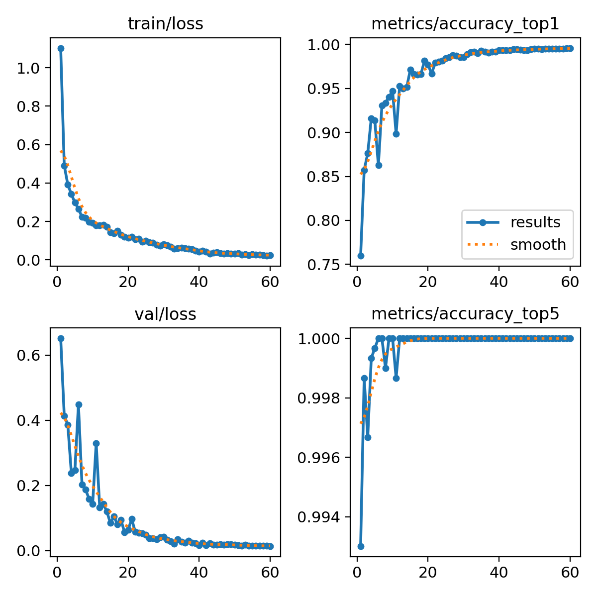
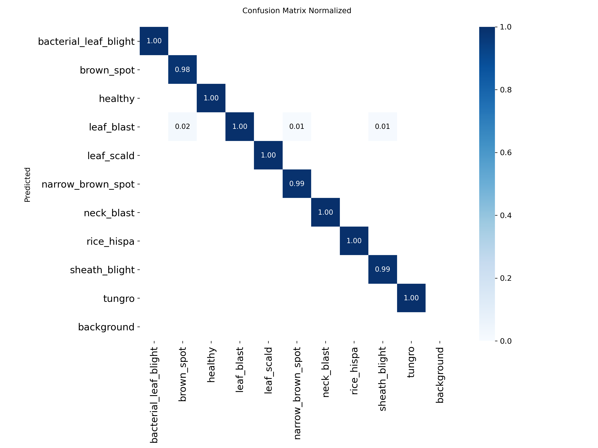

# AgroFarmer — AI-Powered Rice Disease Advisor

Assam is an agricultural state where a significant portion of people's livelihood depends on farming. Living in a modern era, I asked myself — why can't we use technology for the betterment of our farmers?

Thinking of that, I started **AgroFarmer** — a project that helps farmers identify crop diseases, gather information about those diseases, and get guidance on the precautions, pesticides, and fertilizers they should use. For this version, I selected Rice as the crop and built a rice disease identification and information query system as the foundation of AgroFarmer.

---

## Problem Statement

Farmers often face difficulties in:
- Identifying crop diseases early before significant yield loss
- Choosing suitable fertilizers and treatments
- Predicting crop risks from weather conditions
- Getting expert guidance quickly and in their local language

AgroFarmer addresses these challenges by combining computer vision, retrieval-augmented generation (RAG), and large language models into a single unified assistant.

---

## Features

- **Disease Detection** — Upload a rice leaf image and get instant disease identification with confidence score
- **Treatment Recommendations** — AI-generated treatment plans grounded in real ICAR, IRRI, and FAO agricultural documents
- **Weather-Aware Advice** — Real-time weather data factored into every recommendation
- **RAG Knowledge Base** — Answers retrieved from expert agricultural documentation, not LLM guesswork
- **Multilingual Support** — Recommendations in English, Hindi, and Assamese

---

## Architecture

```
Farmer Input (Leaf Image + Location + Language)
 ↓
 ┌───────────────────────────────┐
 │ FastAPI Backend │
 │ │
 │ YOLOv8n-cls → Disease + │
 │ Confidence │
 │ │
 │ OpenWeatherMap → Weather │
 │ Context │
 │ │
 │ ChromaDB RAG → Relevant │
 │ Doc Chunks │
 │ │
 │ Groq Llama 3.3-70B │
 │ ↓ │
 │ Structured Recommendation │
 └───────────────────────────────┘
 ↓
 Streamlit Frontend
```

---

## Supported Disease Classes

| # | Disease |
|---|---------|
| 1 | Bacterial Leaf Blight | 
| 2 | Brown Spot |
| 3 | Leaf Blast |
| 4 | Leaf Scald |
| 5 | Narrow Brown Spot | 
| 6 | Neck Blast | 
| 7 | Rice Hispa | 
| 8 | Sheath Blight |
| 9 | Tungro | 
| 10 | Healthy | 

---

## Model Performance

| Metric | Value |
|--------|-------|
| Model Architecture | YOLOv8n-cls |
| Total Dataset Size | 15,023 images |
| Training Samples | 10,516 |
| Validation Samples | 3,005 |
| Test Samples | 1,502 |
| Validation Accuracy | 99.6% |
| Test Accuracy | 99.4% |
| Inference Speed | 0.3ms/image |
| Disease Classes | 10 |

---

## Tech Stack

| Layer | Technology |
|-------|-----------|
| Disease Detection | YOLOv8n-cls (Ultralytics) |
| Backend API | FastAPI + Uvicorn |
| LLM | Groq Llama 3.3-70B |
| Vector Database | ChromaDB |
| Embeddings | sentence-transformers (all-MiniLM-L6-v2) |
| Document Loading | LangChain + PyPDF |
| Weather | OpenWeatherMap API |
| Frontend | Streamlit |
| Training Environment | Google Colab (Tesla T4 GPU) |
| Dataset Annotation | Roboflow |

---

## Project Structure

```
AgroFarmer/
├── models/
│ └── best.pt # Trained YOLOv8 weights (download separately)
├── knowledge_base/
│ ├── docs/ # Rice disease PDFs (ICAR, IRRI, FAO)
│ │ ├── leaf_blast.pdf
│ │ ├── bacterial_leaf_blight.pdf
│ │ ├── brown_spot.pdf
│ │ ├── sheath_blight.pdf
│ │ ├── tungro.pdf
│ │ └── ...
│ └── chroma_db/ # Auto-generated vector store
├── main.py # FastAPI backend
├── rag_service.py # RAG pipeline (ChromaDB + LangChain)
├── app.py # Streamlit frontend
├── yolov8_model.ipynb # Training notebook (Google Colab)
├── requirements.txt
└── .env # API keys (not committed)
```

---

## Setup & Installation

### 1. Clone the repository
```bash
git clone https://github.com/rajesh-snippet/AgroFarmer.git
cd AgroFarmer
```

### 2. Create virtual environment
```bash
python -m venv venv

# Windows
venv\Scripts\activate

# Mac/Linux
source venv/bin/activate
```

### 3. Install dependencies
```bash
pip install -r requirements.txt
```

### 4. Set up environment variables
Create a `.env` file in the project root:
```
GROQ_API_KEY=your_groq_api_key
OPENWEATHER_API_KEY=your_openweathermap_api_key
```

Get your API keys:
- Groq: [console.groq.com](https://console.groq.com)
- OpenWeatherMap: [openweathermap.org](https://openweathermap.org)

### 5. Download model weights
Download `best.pt` from [Google Drive](https://drive.google.com/file/d/1RGWcCIsu_Bev2gsDzQ9JLdxMuKkK1QxR/view?usp=sharing) and place it in the `models/` folder.

### 6. Build RAG knowledge base
```bash
python rag_service.py
```
This loads all PDFs, creates embeddings, and saves ChromaDB to `knowledge_base/chroma_db/`.
*(First run takes 2-3 minutes. Subsequent runs load instantly from disk.)*

### 7. Run the application

**Terminal 1 — FastAPI backend:**
```bash
uvicorn main:app --reload
```

**Terminal 2 — Streamlit frontend:**
```bash
streamlit run app.py
```

Open `http://localhost:8501` in your browser.

---

## API Endpoints

| Method | Endpoint | Description |
|--------|----------|-------------|
| GET | `/health` | Health check, confirms model loaded |
| POST | `/detect-disease` | Upload leaf image → disease + confidence |
| GET | `/weather` | Get weather by city or coordinates |
| POST | `/recommend` | Disease + context → LLM recommendation |
| POST | `/advisor` | Full pipeline — image + location + language |

API documentation available at `http://127.0.0.1:8000/docs` (Swagger UI).

---

## API Usage Example

```python
import requests

# Full advisor pipeline
with open("leaf_image.jpg", "rb") as f:
 response = requests.post(
 "http://127.0.0.1:8000/advisor",
 files={"file": f},
 params={
 "language": "english",
 "city": "Tezpur"
 }
 )

print(response.json())
```

**Sample Response:**
```json
{
 "detection": {
 "disease": "leaf_blast",
 "confidence": 0.9823,
 "is_healthy": false
 },
 "weather": {
 "location": "Tezpur",
 "temperature": 31.2,
 "humidity": 88,
 "advisory": ["High humidity — increased risk of fungal diseases."]
 },
 "recommendation": "...",
 "language": "english"
}
```

---

## Development Journey

### Dataset Preparation
Collected 15,023 rice disease images across 10 classes. Dataset annotated and split using Roboflow (70% train / 20% val / 10% test).

### Model Training
Fine-tuned YOLOv8n-cls on Google Colab (Tesla T4 GPU) for 60 epochs with AdamW optimizer, cosine LR decay, and label smoothing. Achieved 99.4% test accuracy.

## Model Training Results

### Training Curves


### Confusion Matrix


### Backend Development
Built FastAPI backend with 5 endpoints covering disease detection, weather integration, RAG-powered recommendations, and a unified advisor pipeline.

### RAG Knowledge Base
Collected 9 authoritative PDFs from ICAR, IRRI, and FAO covering all supported rice diseases. Chunked into 1,024 segments, embedded with sentence-transformers, and stored in ChromaDB.

> **Note:** Development was focused on rapid building and experimentation. Commits were pushed at project milestones rather than continuously.

---

## Planned Improvements

- [ ] CrewAI multi-agent orchestration (Disease Agent + Weather Agent + Knowledge Agent + Recommendation Agent)
- [ ] Improved Assamese language support via IndicTrans2
- [ ] Expand to potato and tomato crops
- [ ] Mobile-friendly frontend

---

## Author

**Rajesh Sarma Bordoloi**
AI Engineer | GenAI | FastAPI | Computer Vision

[GitHub](https://github.com/rajesh-snippet) · [LinkedIn](#)

---

## License

This project is licensed under the MIT License.
